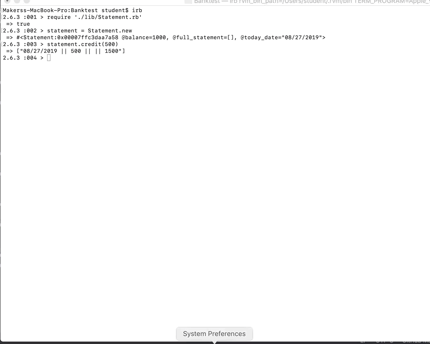

## Installation
Clone the repository ``` git@github.com:Kaymo1990/BankingApp.git ```
Run bundle install to install the gem dependencies.
To open the program you can open it using ruby ``` ruby statement.rb ```
To run tests you can run the command rspec.



## Approach

The application was created using Ruby and can be run in the command line by opening the file using the ruby keyword followed by the filename 'statement.rb'. The application includes the following features:

```
A user has an account balance set initially to 1000.
```

```
A user can make a credit deposit which will update the balance and add a transaction.
```

```
A user can make a debit withdrawal which will update the balance and add a transaction.
```

```
A user can return a bank statement with all transactions in reverse chronological order and column headers for each part of their bank transaction
```

## Instructions
```
Create a new statement object
any_object_name = Statement.new
```

```
Retrieve the current balance
any_object_name.balance
```

```
Make a credit deposit
any_object_name.credit(insert a number into here)
```

```
Make a debit withdrawal
any_object_name(insert a number into here)
```

```
Return a full statement of your transactions
any_object_name.returnStatement
```
## Structure

The code has been structured as a single statement class with three methods for depositing, withdrawing and returning all transactions. The user input is used to modify a general transaction string of 'date || credit || debit || balance', which is then pushed into an array. Upon returning all transactions, the transactions are returned in reverse order, therefore the newest transactions are shown first.

Feel free to contribute!
